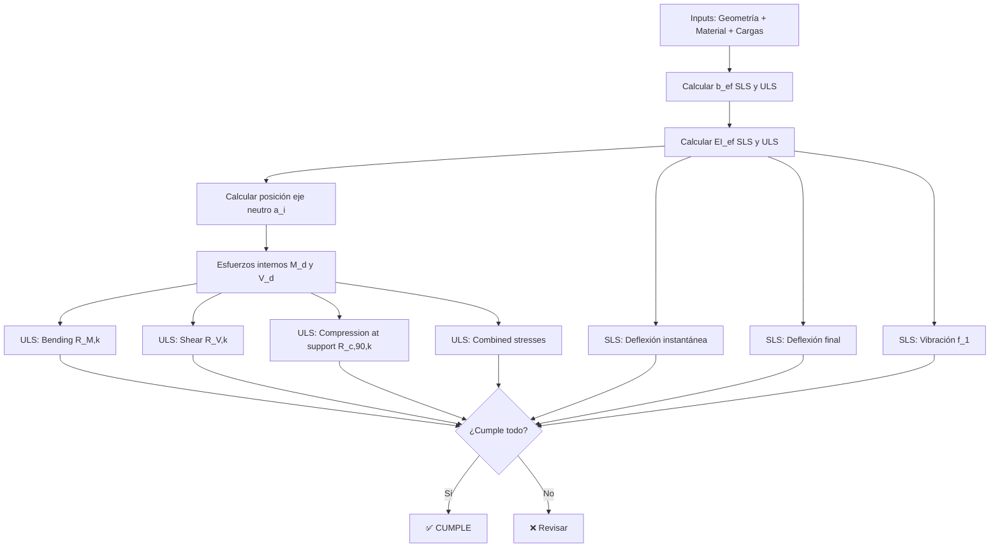

# Análisis del PDF: Kerto-Ripa Design Instructions

## 1. Estructura del Documento

El PDF tiene **67 páginas** dividido en **4 secciones principales**:

| Sección | Contenido | Páginas |
|---------|-----------|---------|
| **A** | Métodos de diseño de elementos Kerto-Ripa | 8–32 |
| **B** | Ejemplo de cálculo | 33–39 |
| **C** | Elementos Kerto-Ripa soportados por losa superior (Top slab supported) | 40–56 |
| **D** | Elementos Kerto-Ripa reforzados en apoyos (Support reinforced) | 57–67 |

---

## 2. Producto: ¿Qué es un Kerto-Ripa?

Un **stressed skin panel** (panel de carga con revestimiento) fabricado con Kerto® LVL (madera microlaminada):
- **Ribs (nervios)**: Kerto-S (webs/almas)
- **Slabs (losas/alas)**: Kerto-Q (flanges/alas) — o Kerto-S para la losa inferior en open box
- Unión mediante adhesivo poliuretánico

### Tipos de secciones

```
┌──────────────────────────────────────────────────────────┐
│ 1. Ribbed slab     → Solo losa superior (o inferior)     │
│ 2. Box slab        → Losa superior + losa inferior       │
│ 3. Open box slab   → Box con losa inferior discontinua   │
│ 4. Box slab (top   → Box donde la losa superior no       │
│    no composite)     participa en la sección compuesta   │
└──────────────────────────────────────────────────────────┘
```

---

## 3. Sección A: Métodos de Cálculo — Resumen de Ecuaciones

### A.1 — Ancho eficaz del ala `b_ef` (Ecuaciones A.1 – A.4)

**Concepto clave**: Cada sección efectiva (I, T o C) se verifica independientemente.

```
b_ef,i = b_L,i + b_w,i + b_R,i                     (A.1)
```

donde `b_L,i ≤ 0.5 × b_f,i` y `b_R,i ≤ 0.5 × b_{f+1,i}`

#### SLS (Estado Límite de Servicio):

**Nervios intermedios:**
```
b_L,SLS = min(0.5 × L_ef / 20, b_f,i)              (A.2a)
b_R,SLS = min(0.5 × L_ef / 20, b_{f+1,i})
```

**Nervios de borde:**
```
b_L,SLS = min(0.5 × L_ef / 20, b_f,i)              (A.2b)
b_R,SLS = min(0.5 × L_ef / 20, b_{f+1,i})
```

#### ULS (Estado Límite Último):

**Nervios intermedios:**
```
b_L,ULS = min(0.5 × L_ef / 20, 12 × h_f, b_f,i / 2)   (A.3a)
b_R,ULS = min(0.5 × L_ef / 20, 12 × h_f, b_{f+1,i} / 2)
```

**Nervios de borde:**
```
b_L,ULS = min(0.5 × L_ef / 20, 12 × h_f, b_f,i)    (A.3b)
b_R,ULS = min(0.5 × L_ef / 20, 12 × h_f, b_{f+1,i})
```

**Criterio de pandeo de placa (siempre):**
```
b_free_edge ≤ 20 × h_f   (Kerto-Q)                  (A.4a)
b_free_edge ≤ 10 × h_f   (Kerto-S)                  (A.4b)
```

**Distancia máxima entre nervios**: 1250 mm

---

### A.4 — Rigidez a flexión efectiva `EI_ef` (Ecuaciones A.5 – A.10)

```
EI_ef = Σ(E_i × I_i) + Σ(E_i × A_i × a_i²)         (A.5/A.6)
```

donde:
- `E_i` = Módulo de elasticidad medio del miembro i
- `A_i = b_i × h_i` (área de sección)
- `I_i = b_i × h_i³ / 12` (momento de inercia)
- `a_i` = distancia del centroide del miembro i al eje neutro del conjunto

**Posición del eje neutro** (para box slab):
```
a_2 = (E_1 × A_1 × (h_1 + h_2)/2 - E_3 × A_3 × (h_2 + h_3)/2) / (E_1 × A_1 + E_2 × A_2 + E_3 × A_3)   (A.8)
```

**Distancias:**
```
a_1 = 0.5 × h_1 + 0.5 × h_2 - a_2                   (A.7)
a_3 = 0.5 × h_3 + 0.5 × h_2 + a_2                   (A.10)
```

> [!IMPORTANT]
> Se usan valores **E_mean** tanto en SLS como en ULS. En SLS, la deformación por fluencia se calcula con el factor `k_def` → `1/(1 + k_def)`.

---

### A.5 — Resistencia a flexión `R_M,k` (Ecuaciones A.11 – A.21)

Se calcula como el **mínimo** de 4 casos:

| Caso | Ecuación | Verifica |
|------|----------|----------|
| Compresión en ala | A.11 | `R_M,c,k = f_c,0,k × EI_ef / (E_mean,i × a_i)` |
| Tracción en ala | A.12 | `R_M,t,k = k_l × f_t,0,k × EI_ef / (E_mean,i × a_i)` |
| Borde del alma (flexión) | A.14 | `R_M,m,k = k_h × f_m,k × EI_ef / (E_mean,2 × (h_2/2 + a_2))` |
| Centro del alma (centric) | A.19 | `R_M,m,centric,k = f_m,k × EI_ef / (E_mean,i × h_i)` |

**Factores de corrección:**
```
k_l = min(1.1, (3000/L_ef)^0.06)                     (A.13) — Factor de longitud para tracción
k_h = min(1.2, (300/h_i)^0.12)                       (A.15) — Factor de altura para flexión
```

**Pandeo lateral-torsional del alma** (para ribbed slabs → borde libre en compresión):
- Esbeltez relativa → `σ_m,rel = √(f_m,k,w / σ_m,crit)`
- `k_crit` según EC5 §6.3.3 ecuación (6.34)
- `R_M,buckling,k = k_crit² × R_M,m,k`

**Para almas cónicas (tapered webs):**
```
k_m,α,c = factor de reducción por compresión           (A.20)
k_m,α,t = factor de reducción por tracción              (A.21)
```

---

### A.6 — Resistencia a cortante `R_V,k` (Ecuaciones A.22 – A.25)

Se calcula como el **mínimo** de 3 casos:

| Caso | Ecuación | Verifica |
|------|----------|----------|
| Unión losa superior–alma | A.22 | `R_V,top,k` |
| Cortante en el alma | A.23 | `R_V,web,k` |
| Unión losa inferior–alma | A.24 | `R_V,bottom,k` |

**Unión losa–alma:**
```
R_V,top,k = min(
    k_gl × f_v,0,flat,S,k × b_2,eff,t × EI_ef / (E_mean × A_1 × a_1),
    f_v,0,flat,S,k × b_w × EI_ef / (E_mean × A_1 × a_1)
)                                                      (A.22)
```

**Ancho eficaz de la unión:**

Nervios intermedios:
```
b_eff = 0.7 × b + 30 mm,   k_gl = 1.30              (A.25a)
```

Nervios de borde:
```
b_eff = max(0.7 × b, b - 15 mm),   k_gl = 1.15      (A.25b)
```

Kerto-S flanges (open box): `b_eff = b`, `k_gl = 1.00`

---

### A.7 — Resistencia axial `R_N,k` (Ecuaciones A.26 – A.27)

```
R_T,i,k = f_t,0,k × A_i × E_i / ΣE_i               (A.26)  — Tracción
R_C,i,k = f_c,0,k × A_i × E_i / ΣE_i               (A.27)  — Compresión
```

---

### A.8 — Tensiones combinadas (Ecuaciones A.28 – A.31)

```
M_d / R_M,t,d + N_d / R_T,d ≤ 1.0   (tracción + flexión)       (A.28)
M_d / R_M,c,d + N_d / R_C,d ≤ 1.0   (compresión + flexión)     (A.29)
M_d / R_M,t,web,d + N_d / R_T,web,d + M_d / R_M,m,centric,d ≤ 1.0   (A.30)
(M_d / R_M,c,web,d)² + N_d / R_C,web,d + M_d / R_M,m,centric,d ≤ 1.0  (A.31)
```

---

### A.9 — Compresión perpendicular a la fibra en apoyos (Ecuaciones A.32 – A.36)

#### 9.1 — Método ribbed y losa delgada (h_slab ≤ 51 mm):
```
R_c,90,k = k_c,90,web,k × f_c,90 × b_w × L_ef,support   (A.32)
```

#### 9.2 — Método losa gruesa (h_slab > 51 mm):
```
R_c,90,web = k_c,90 × f_c,90,web × b_w × L_ef,support   (A.33)  — Basado en alma
R_c,90,slab = k_c,90 × f_c,90,slab × b_ef,support × L_ef,support (A.34) — Basado en losa
```

---

### A.10 — Vibración (Ecuaciones A.37)

- Frecuencia natural: `f_1 = (π/2L²) × √(EI_SLS / (m × b_spacing))`
- Deflexión bajo 1 kN: `u = F × L³ / (k × 42 × EI_L × √(EI_B/EI_L))`
- Rigidez transversal (box slabs): `(EI)_B = 0.13 × E_mean,90 × B × (H_tot³ - H_web³) / 12`

---

## 4. Sección B: Ejemplo de Diseño

Parámetros del ejemplo:
- **h_w** = 225 mm, **b_w** = 45 mm, **h_f** = 25 mm
- **Spacing** = 585 mm, **Span** = 5500 mm, **Support** = 100 mm
- **g** = 0.9 kN/m², **q** = 2.5 kN/m²
- **M_d** = 11 kNm, **V_d** = 8 kN

**Resultados clave:**
- `R_M,k = min(107.1, 103.2, 158.5) = 103.2 kNm`
- `R_V,k = min(29.1, 29.1, 43.1) = 29.1 kN`
- `R_c,90,k = 37.2 kN`
- Deflexión instantánea = 5.38 mm < L/300 = 18.3 mm ✓
- Deflexión final = 6.95 mm < L/200 = 27.5 mm ✓

---

## 5. Secciones C y D: Funcionalidad Avanzada

### Sección C — Elementos soportados desde la losa superior
6 modos de fallo a verificar:
1. Cortante en losa (rolling shear Kerto-Q)
2. Flexión en losa
3. Cortante en nervio (notched beam)
4. Arranque de tornillos de anclaje
5. Pull-through de tornillos de anclaje
6. Capacidad de tornillos inclinados

### Sección D — Refuerzo en apoyos
5 verificaciones:
1. Compresión reforzada perpendicular a fibra
2. Compresión en cota superior del refuerzo
3. Capacidad de cortante en línea de cola
4. Pandeo del alma

---

## 6. Parámetros de Entrada Necesarios

### 6.1 Geometría de la sección
| Parámetro | Descripción | Unidad |
|-----------|-------------|--------|
| `h_w` | Altura del alma (rib) | mm |
| `b_w` | Ancho del alma (rib) | mm |
| `h_f1` | Espesor losa superior | mm |
| `h_f2` | Espesor losa inferior | mm |
| `b_f` | Distancia entre almas (spacing) | mm |
| Tipo de sección | Ribbed / Box / Open Box | enum |
| Posición del nervio | Edge / Middle | enum |

### 6.2 Geometría del elemento
| Parámetro | Descripción | Unidad |
|-----------|-------------|--------|
| `L_ef` | Luz de cálculo | mm |
| `n_ribs` | Número de nervios | — |
| `L_support` | Longitud de apoyo | mm |
| Tipo de apoyo | End / Intermediate | enum |

### 6.3 Material (ETA-07/0029)
| Propiedad | Material | Unidad |
|-----------|----------|--------|
| `E_mean` (Kerto-S) | 13800 | MPa |
| `E_mean` (Kerto-Q) | 10500 | MPa |
| `f_m,k` (Kerto-S) | 44 | MPa |
| `f_c,0,k` (Kerto-Q) | 26 | MPa |
| `f_t,0,k` (Kerto-Q) | 26 | MPa |
| `f_v,0,flat,S,k` | 2.3 (Kerto-S) / 1.3 (Kerto-Q) | MPa |
| `f_v,0,edge,k` (Kerto-S) | 4.1 | MPa |
| `f_c,90,web,k` | 6.0 | MPa |
| `G` (Kerto-S) | 600 | MPa |
| `k_def` | 0.60 (SC1) | — |
| `k_mod` | 0.8 (medio plazo) | — |
| `γ_M,LVL` | 1.2 (Finlandia) | — |

### 6.4 Cargas
| Parámetro | Descripción | Unidad |
|-----------|-------------|--------|
| `g` | Carga permanente | kN/m² |
| `q` | Sobrecarga | kN/m² |
| Duration class | Short / Medium / Long / Perm | enum |
| Service class | 1 / 2 / 3 | enum |

---

## 7. Flujo de Verificaciones (Workflow de Cálculo)



---

## 8. Propuesta de Arquitectura

### 8.1 Backend — Módulos de Cálculo

```
app/domain/kertoripa/
├── __init__.py
├── geometry.py          → b_ef, áreas, inercias, eje neutro (§A.3, A.4)
├── bending.py           → R_M,k (4 modos de fallo) (§A.5)
├── shear.py             → R_V,k (3 modos de fallo) (§A.6)
├── axial.py             → R_N,k tracción/compresión (§A.7)
├── combined.py          → Verificación combinada (§A.8)
├── support.py           → R_c,90,k en apoyos (§A.9)
├── vibration.py         → f_1 y deflexión puntual (§A.10)
├── serviceability.py    → Deflexiones SLS (inst + final + shear)
├── top_slab_support.py  → Sección C (6 modos de fallo)
└── reinforcement.py     → Sección D (4 modos de fallo)
```

```
app/schemas/
├── kertoripa.py         → Pydantic models: Request + Response
└── kertoripa_materials.py → Propiedades ETA-07/0029 como constantes
```

```
app/api/
└── routes.py            → POST /calculate/kerto-ripa
```

> [!TIP]
> Cada módulo recibe la geometría computada y devuelve un resultado `CheckResult` con demand/capacity/utilization/passed, reutilizando el patrón existente en `floor_joist.py`.

### 8.2 Frontend — Experiencia de Usuario

#### Opción recomendada: **Wizard multi-paso** (stepper)

```
┌─────────┐    ┌──────────┐    ┌──────────┐    ┌───────────┐    ┌───────────┐
│ Paso 1   │──▶│ Paso 2    │──▶│ Paso 3    │──▶│ Paso 4     │──▶│ Paso 5     │
│ Tipo de  │    │ Geometría│    │ Cargas    │    │ Apoyos     │    │ Resultados │
│ sección  │    │          │    │           │    │            │    │            │
└─────────┘    └──────────┘    └──────────┘    └───────────┘    └───────────┘
```

#### Detalle de cada paso:

**Paso 1 — Tipo de sección:**
- Selector visual con iconos de las 4 tipologías (Ribbed, Box, Open Box, Box no composite)
- Al seleccionar → actualiza los campos disponibles en los siguientes pasos

**Paso 2 — Geometría:**
- Subgrupo "Nervio/Alma": `h_w`, `b_w`, cantidad, posición (edge/middle)
- Subgrupo "Losa superior": `h_f1`, toggle on/off según tipo de sección
- Subgrupo "Losa inferior": `h_f2`, toggle on/off, `b_actual` para open box
- Subgrupo "Elemento": `L_ef`, spacing, nº ribs
- **Preview SVG en tiempo real** de la sección transversal → mismo patrón que la previsualización que ya tienes en el frontend para la sección rectangular

**Paso 3 — Material + Cargas:**
- Material: preset Kerto-S + Kerto-Q con valores ETA-07/0029 (no editable por defecto, toggle para "valores personalizados")
- Service class (1/2/3) → autocompleta `k_def`
- Load duration class → autocompleta `k_mod`
- National annex → autocompleta `γ_M`
- Cargas: `g` (kN/m²), `q` (kN/m²), tipo de combinación
- `ψ_2` según EC 1990

**Paso 4 — Apoyos:**
- Tipo: simple span / continuo
- `L_support`, tipo (end/intermediate)
- ¿Refuerzo? → activa sección D
- ¿Soporte desde losa superior? → activa sección C

**Paso 5 — Resultados:**
- Vista tipo "report" con cada verificación como tarjeta:
  - 🟢 / 🔴 pass/fail
  - Barra de utilización (demand/capacity)
  - Valor de demand y capacity con formato
- Sección expandible con valores intermedios (a_i, EI_ef, b_ef, etc.)
- Diagrama de la sección con anotaciones
- Exportar a PDF

---

## 9. Preguntas Abiertas para Decisión

> [!IMPORTANT]
> **¿Qué alcance queremos para la primera versión?**

1. **¿Solo Sección A+B (core)?** Es decir: cálculo de sección efectiva, bending, shear, support compression, SLS. Esto es suficiente para un primer MVP funcional. Las secciones C y D son extensiones especializadas que añaden complejidad.

2. **¿Queremos que el usuario pueda elegir el National Annex?** El PDF usa valores finlandeses (γ_M = 1.2). ¿Incluimos España u otros?

3. **¿Incluimos el cálculo de vibración?** Es la parte más compleja del SLS y requiere calcular la rigidez transversal EI_B del conjunto, no solo de un nervio.

4. **¿Las propiedades de material son fijas (ETA-07/0029) o editables?** Fijarlas simplifica enormemente la UX y reduce errores del usuario.

5. **¿El frontend mantendrá las cargas como kN/m² con combinaciones Eurocode, o simplificamos con M_d y V_d ya dados?** Tu sistema de combinaciones actual se podría reutilizar.

6. **¿Los esfuerzos internos (M_d, V_d) los calcula el backend a partir de las cargas y la luz (viga simplemente apoyada), o el usuario los introduce directamente?** El ejemplo del PDF asume que ya están calculados.
